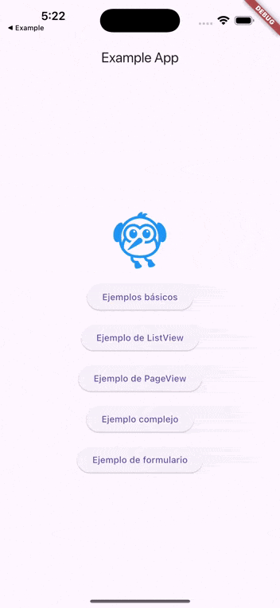
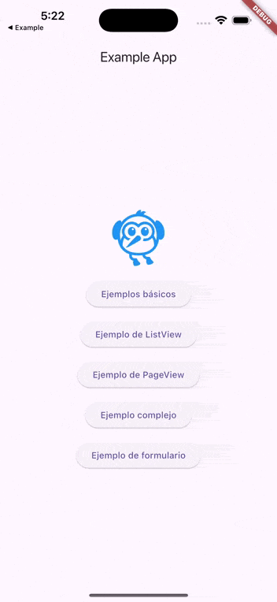
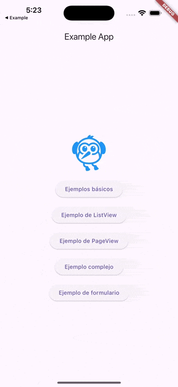
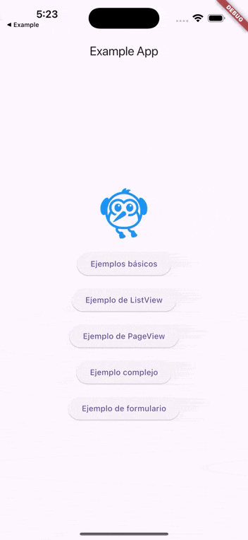
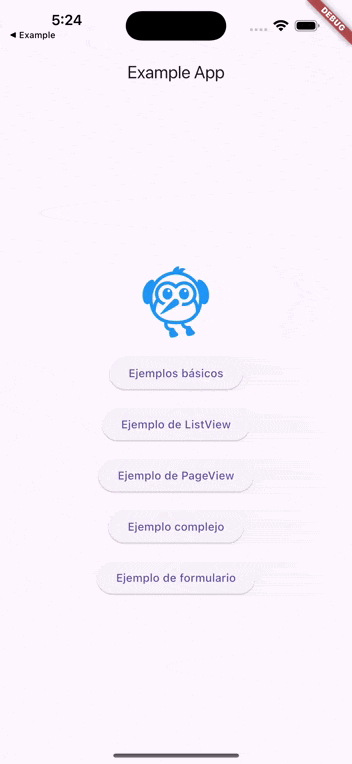

# Flutter Skeleton Loader

[](https://pub.dev/packages/flutter_skeleton_loader)
[](https://codecov.io/gh/idamkiller/flutter_skeleton_loader)
[](https://opensource.org/licenses/MIT)
[](https://github.com/idamkiller/flutter_skeleton_loader/actions/workflows/tests.yml)


Una biblioteca Flutter para crear efectos de carga (skeletons) elegantes y personalizables para tus aplicaciones. Proporciona una forma sencilla de mostrar placeholders mientras se cargan los datos reales.

## Características

- 🚀 Fácil de implementar con un solo widget `SkeletonLoader`
- 🎨 Personalizable con colores y dimensiones
- 🔄 Soporte para todos los widgets comunes de Flutter
- 📱 Diseño responsivo
- ⚡ Rendimiento optimizado
- 🧪 Cobertura de pruebas completa

## Instalación

Agrega la dependencia a tu archivo `pubspec.yaml`:

```yaml
dependencies:
  flutter_skeleton_loader: ^1.1.0
```

Luego ejecuta:

```bash
flutter pub get
```

## Uso básico

```dart
import 'package:flutter/material.dart';
import 'package:flutter_skeleton_loader/flutter_skeleton_loader.dart';

class MyWidget extends StatefulWidget {
  @override
  _MyWidgetState createState() => _MyWidgetState();
}

class _MyWidgetState extends State<MyWidget> {
  bool isLoading = true;

  @override
  void initState() {
    super.initState();
    // Simular carga de datos
    Future.delayed(Duration(seconds: 2), () {
      setState(() {
        isLoading = false;
      });
    });
  }

  @override
  Widget build(BuildContext context) {
    return SkeletonLoader(
      isLoading: isLoading,
      child: YourActualWidget(),
    );
  }
}
```

## Ejemplos

### Texto

```dart
SkeletonLoader(
  isLoading: isLoading,
  child: Text(
    'Este es un texto que se mostrará cuando termine de cargar',
    style: TextStyle(fontSize: 16),
  ),
)
```

### Imagen

```dart
SkeletonLoader(
  isLoading: isLoading,
  child: Image.network(
    'https://example.com/image.jpg',
    width: 200,
    height: 200,
  ),
)
```

### Lista

```dart
SkeletonLoader(
  isLoading: isLoading,
  child: SizedBox(
    height: 200,
    width: double.infinity,
    child: ListView.builder(
      itemCount: 10,
      itemBuilder: (context, index) {
        return ListTile(
          title: Text('Elemento $index'),
          subtitle: Text('Descripción del elemento $index'),
        );
      },
    ),
  ),
)
```

### Formulario

```dart
SkeletonLoader(
  isLoading: isLoading,
  child: Form(
    child: Column(
      mainAxisAlignment: MainAxisAlignment.center,
      children: <Widget>[
        TextFormField(),
        SizedBox(height: 10),
        TextFormField(),
        SizedBox(height: 10),
        ElevatedButton(
          key: const Key('submitButton'),
          onPressed: () {},
          child: const Text('Enviar'),
        ),
      ],
    ),
  ),
)
```







## Widgets soportados

El paquete soporta automáticamente los siguientes widgets:

- Text
- Image
- Container
- SizedBox
- Card
- IconButton
- Icon
- CircleAvatar
- ListTile
- ListView
- PageView
- TextField
- TextFormField
- Checkbox
- Switch
- Radio (todos los tipos genéricos)
- DropdownButton (todos los tipos genéricos)
- PopupMenuButton (todos los tipos genéricos)
- Slider
- Row
- Column
- Wrap
- Flex
- Form
- GestureDetector

Para los widgets no soportados se crea un esqueleto genérico que se adapta a su tamaño.

## Personalización

El widget `SkeletonLoader` proporciona varias propiedades para personalizar la apariencia y el comportamiento del efecto esqueleto:

```dart
SkeletonLoader(
  // Obligatorio: controla si se muestra el esqueleto o el contenido real
  isLoading: isLoading,
  // Color base del esqueleto
  // Por defecto: Color(0xFFE0E0E0)
  baseColor: Colors.grey[300],
  // Color del efecto de brillo que se mueve a través del esqueleto.
  // Por defecto: Color(0xFFEEEEEE)
  highlightColor: Colors.white,
  // Duración del efecto de brillo
  // Por defecto: Duration(milliseconds: 1500)
  shimmerDuration: Duration(milliseconds: 1500),
  // Duración de la animación de transición entre el esqueleto y el contenido real
  // Por defecto: Duration(milliseconds: 500)
  transitionDuration: Duration(milliseconds: 500),
  // Tu widget real
  child: YourWidget(),
)
```

### Ejemplo completo

Aquí tienes un ejemplo completo que muestra todas las opciones de personalización:

```dart
SkeletonLoader(
  isLoading: isLoading,
  baseColor: Colors.blue[100],
  highlightColor: Colors.blue[50],
  transitionDuration: Duration(milliseconds: 800),
  shimmerDuration: Duration(milliseconds: 1500),
  child: YourWidget(),
)
```

## Contribuir

Las contribuciones son bienvenidas. Si encuentras un bug o tienes una sugerencia, por favor abre un issue en GitHub.

## Licencia

Este proyecto está licenciado bajo la Licencia MIT - ver el archivo [LICENSE](LICENSE) para más detalles.
